#  Consultas avanzadas en MYSQL

## Evidencia de los registros de cada tabla

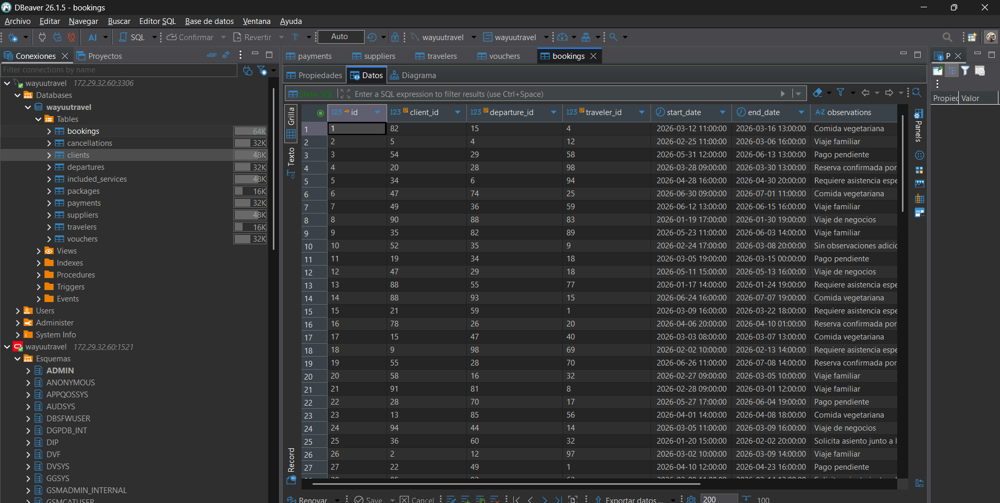

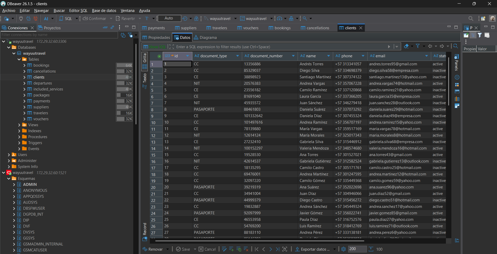](images/clipboard-439859598.png)

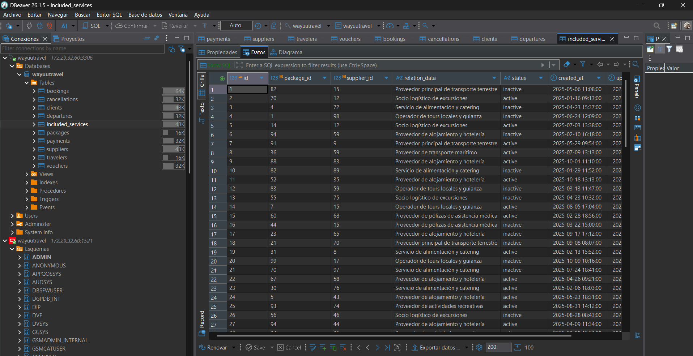](images/clipboard-1883309583.png)

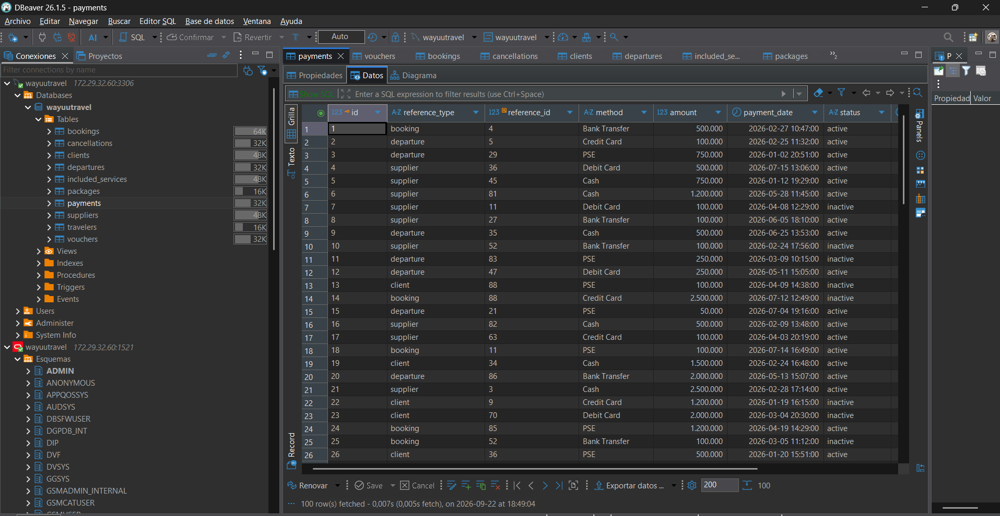](images/clipboard-2832621150.png)

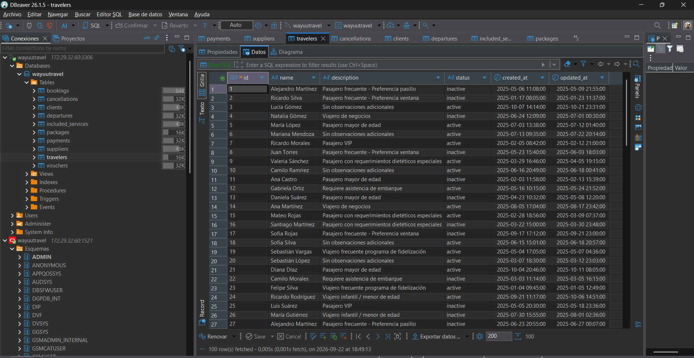](images/clipboard-1839382769.png)

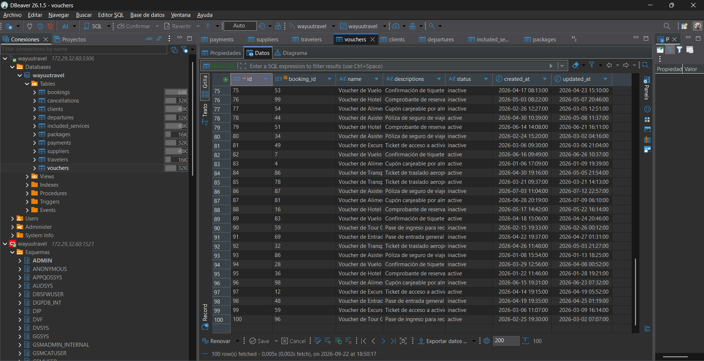

# 1. Consultar datos de una tabla (Consultas Básicas)

### 1.1: Todos los campos de una tabla

``` sql
SELECT * FROM clients;
```

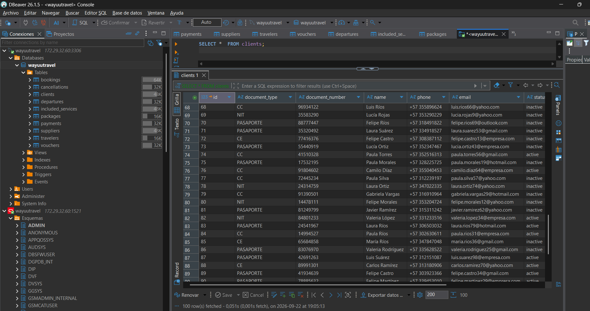

### 1.2: Campos específicos

``` sql
SELECT id,name,phone,document_number   FROM clients;
```

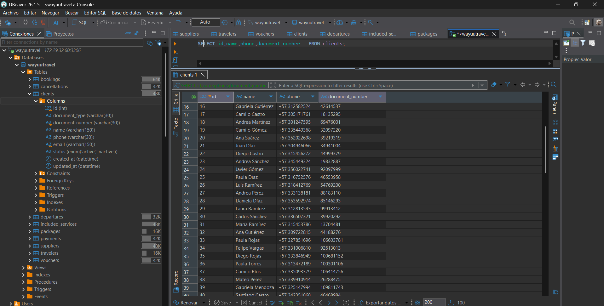

### 1.3: Campos específicos usando alias en la tabla

``` sql
SELECT C.name, C.document_number , C.phone  FROM clients AS C;
```

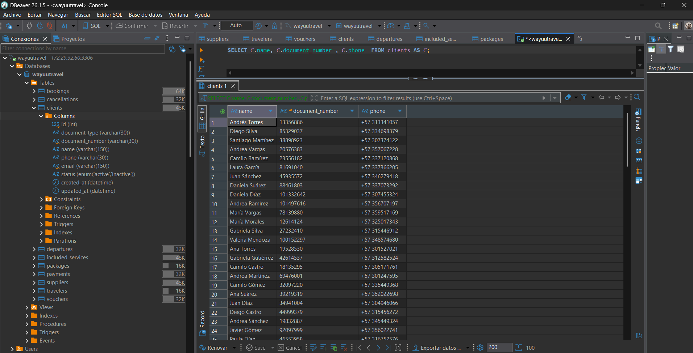

# 2. Consultar datos de varias tablas (Relaciones / Joins)

### 2.1: Relación mediante la cláusula WHERE (Forma 1)

``` sql
SELECT * FROM clients, packages  WHERE clients.id = packages.id;
```

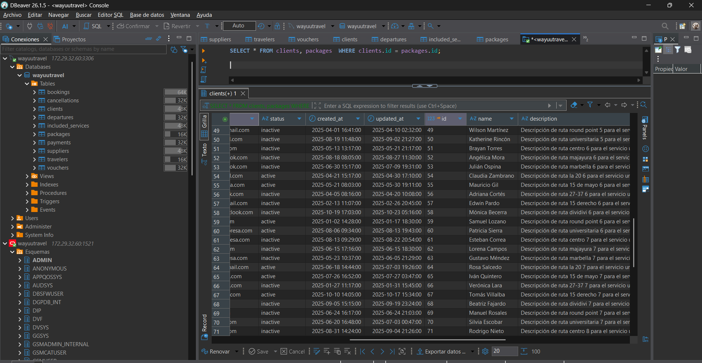

### 2.2: Relación mediante WHERE con alias

``` sql
SELECT * FROM clients AS C, packages AS P WHERE C.id = P.id;
```

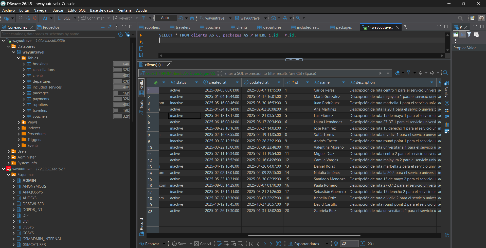

### 2.3: Selección de campos específicos y comodín de tabla (`V.*`) usando WHERE

``` sql
SELECT C.name, C.email, P.* FROM clients AS C, packages  AS P WHERE C.id = P.id;
```

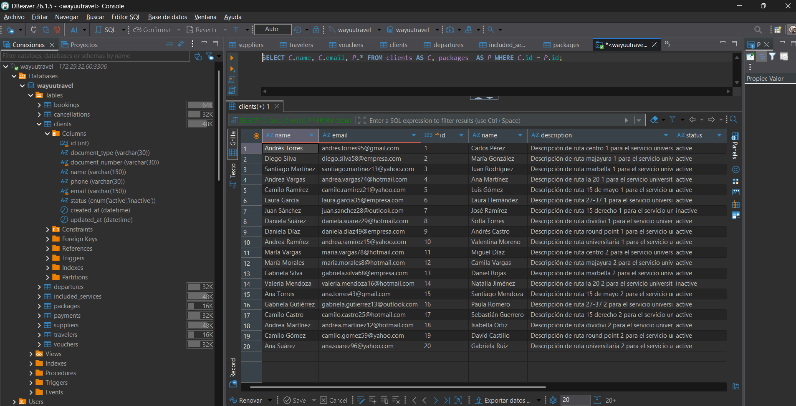

### 2.4: Relación mediante la cláusula JOIN ... ON (Forma 2)

``` sql
SELECT C.name, C.email, B.* FROM clients AS C 
JOIN bookings AS B ON (C.id = B.client_id);
```

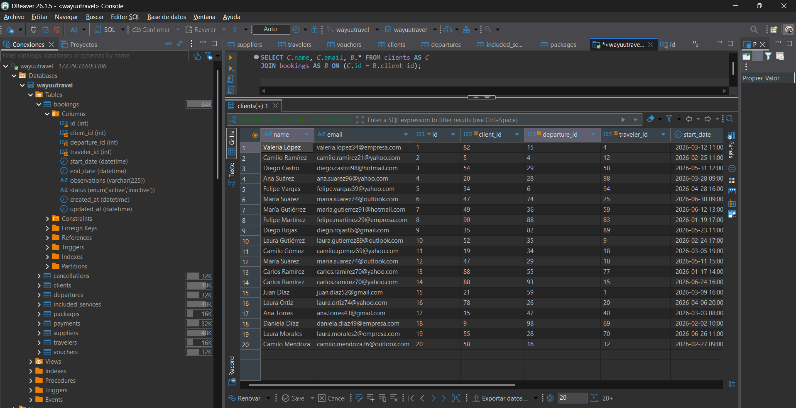

# 3. Condiciones y Filtros en las Consultas

### 3.1: Filtro por fecha en consulta multitabla (Forma 1 - WHERE)

``` sql
SELECT C.name, C.email, B.* FROM clients AS C, bookings  AS B 
WHERE C.id = B.client_id AND B.created_at  = "2026-02-17 11:00:00";
```

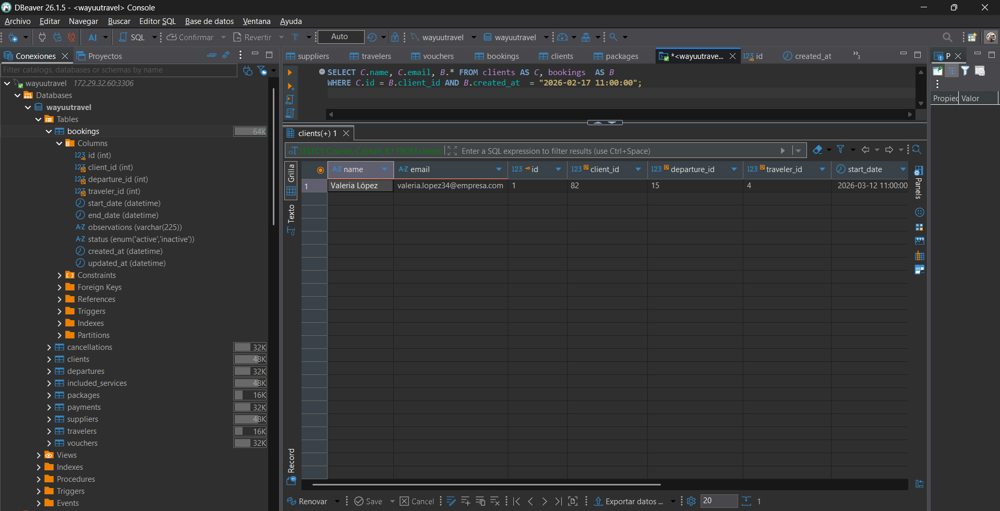

### 3.2: Filtro por fecha en consulta multitabla (Forma 2 - JOIN)

``` sql
SELECT C.name, C.email, B.* 
FROM clients AS C JOIN bookings  AS B ON (C.id = B.id) 
WHERE B.updated_at  = "2026-02-20 11:00:00";
```

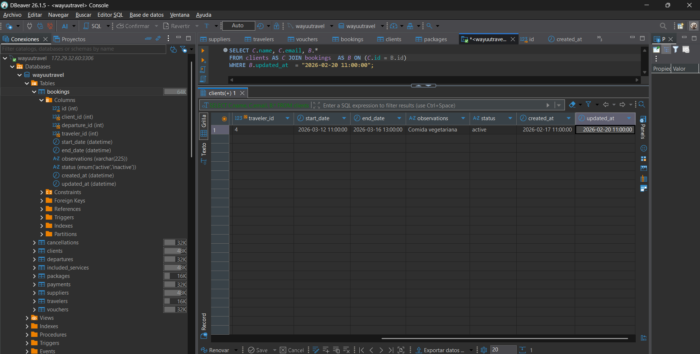

### 3.3: Filtro por patrón con `LIKE` (comienza con 'j' o 'm')

``` sql
SELECT * FROM clients AS C 
WHERE C.name LIKE 'm%' OR C.name LIKE 'j%';
```

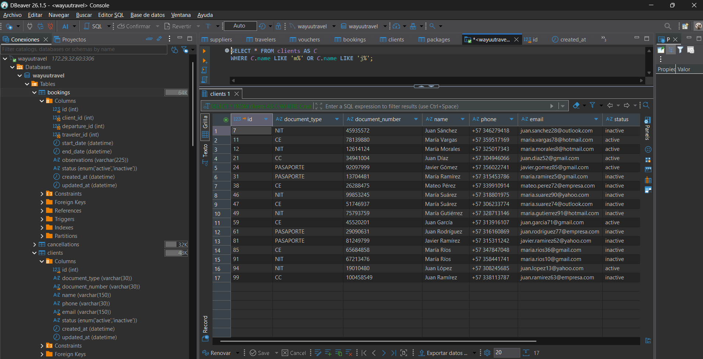

### 3.4: Filtro por patrón con `LIKE` y `CONCAT` (contiene 'Diego Silva' o 'diego.silva58\@gmail.com')

``` sql
SELECT * FROM clients AS C 
WHERE C.name LIKE '%Diego Silva%' or C.email LIKE '%diego.silva58@gmail.com%';
```

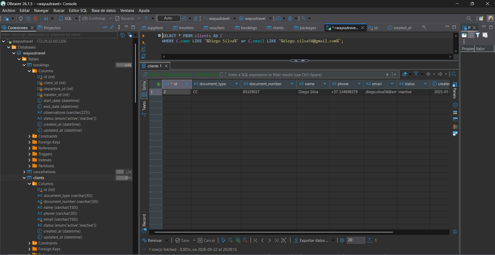

### 3.5: Consulta entre 4 tablas unidas con rango de fechas y ordenamiento (Forma 1 - WHERE)

``` sql
SELECT C.*, B.*, D.*, T.*, V.* 
FROM clients AS C, bookings AS B, departures AS D, travelers AS T,  vouchers AS V 
WHERE C.id = B.client_id 
  AND D.id = B.departure_id 
  AND T.id = B.traveler_id 
  AND B.id = V.booking_id 
  AND V.created_at BETWEEN "2026-05-03 08:22:00" AND "2026-07-03 11:04:00" 
ORDER BY V.created_at ASC;
```

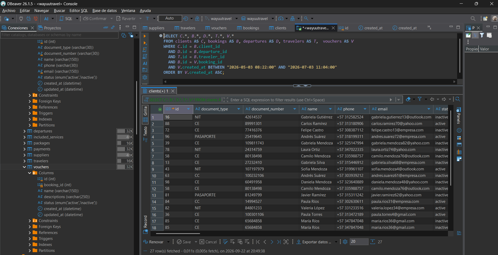

### 3.6: Consulta entre 4 tablas unidas con rango de fechas y ordenamiento (Forma 2 - JOIN)

``` sql
SELECT * 
FROM clients AS C 
JOIN bookings AS B ON (C.id = B.client_id) 
JOIN vouchers AS V ON (B.id = V.booking_id) 
WHERE B.created_at BETWEEN "2026-02-17 11:00:00" AND "2026-05-16 12:00:00" 
ORDER BY B.created_at  ASC;
```

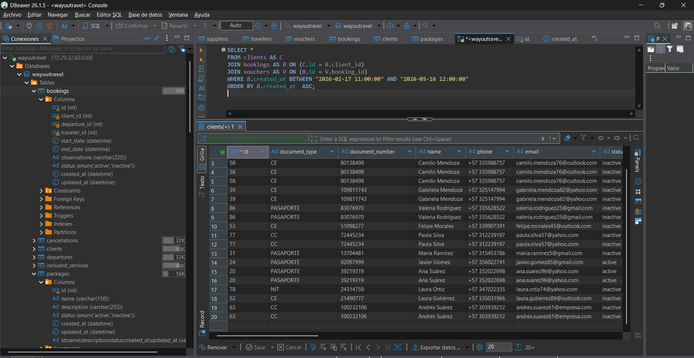

# 4. Consultas de Agrupamiento (`GROUP BY`)

### 4.1: Suma, conteo y promedio por cliente en rango de fechas (Forma 1 - WHERE)

``` sql
SELECT b.client_id, COUNT(p.id) AS total_pagos, SUM(p.amount) AS suma_total_pagada,
AVG(p.amount) AS promedio_por_pago
FROM payments p
INNER JOIN  bookings b ON p.booking_id = b.id
WHERE  p.created_at BETWEEN '2026-01-01 00:00:00' AND '2026-03-31 23:59:59' AND p.status = 'active'AND b.status = 'active'
GROUP BY  b.client_id;
```

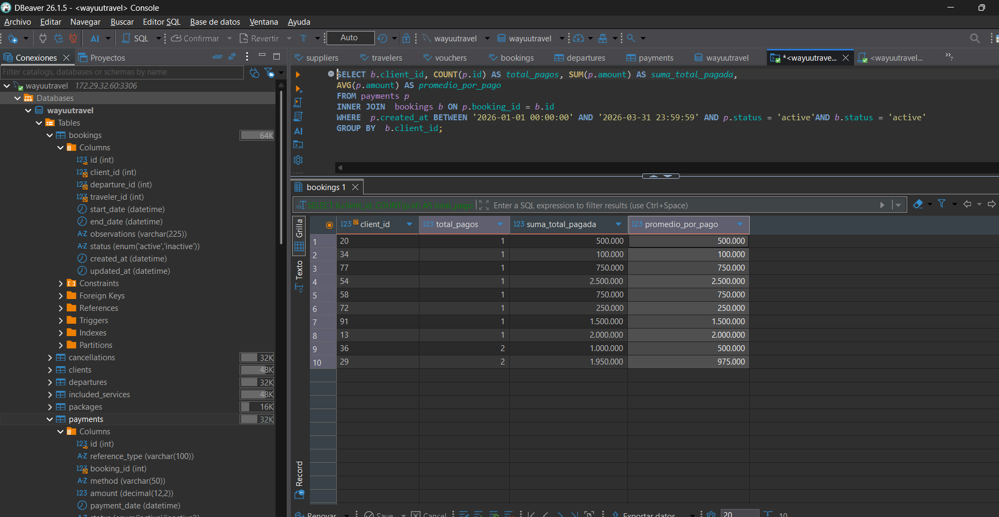

### 4.2: Suma, conteo y promedio por cliente en rango de fechas (Forma 2 - JOIN)

``` sql
SELECT  c.id AS client_id,  c.name AS nombre_cliente,c.document_number,
 COUNT(p.id) AS total_pagos,
 SUM(p.amount) AS suma_total_pagada,
 AVG(p.amount) AS promedio_por_pago
FROM payments p
INNER JOIN bookings b ON p.booking_id = b.id
INNER JOIN clients c ON b.client_id = c.id
WHERE p.created_at BETWEEN '2026-01-01 00:00:00' AND '2026-03-31 23:59:59' 
  AND p.status = 'active'
  AND b.status = 'active'
GROUP BY c.id, c.name, c.document_number;
```

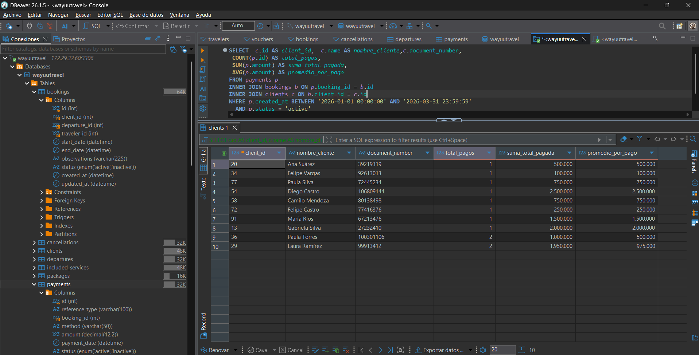

# 5. Consultas de Agrupamiento con Filtro Post-Agregación (HAVING)

### 5.1: Agrupamiento con condición de conteo HAVING (Forma 1 - WHERE)

``` sql
SELECT c.id AS client_id, c.name AS nombre_cliente,
SUM(p.amount) AS TotalSuma, 
COUNT(p.id) AS CuentaTotal, 
AVG(p.amount) AS Promedio  
FROM clients c, bookings b, payments p 
WHERE c.id = b.client_id 
  AND b.id = p.booking_id 
  AND p.payment_date BETWEEN '2026-03-01 00:00:00' AND '2026-03-30 23:59:59'
  AND p.status = 'active'
  AND b.status = 'active'
GROUP BY c.id, c.name 
HAVING COUNT(p.id) >= 1 
ORDER BY TotalSuma DESC;
```

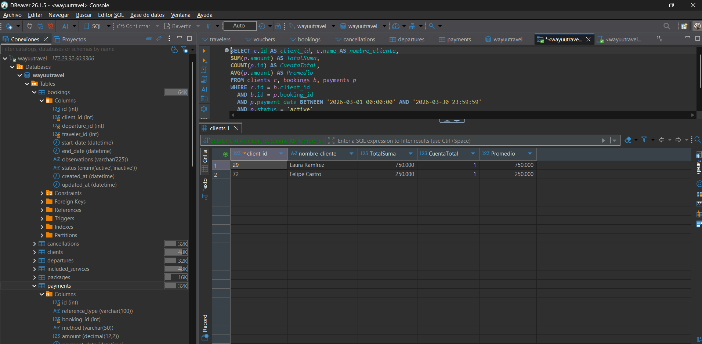

###  5.2: Agrupamiento con condición de conteo `HAVING` (Forma 2 - JOIN)

``` sql
SELECT c.id AS client_id, c.name AS nombre_cliente,
SUM(p.amount) AS TotalSuma, 
COUNT(p.id) AS CuentaTotal, 
AVG(p.amount) AS Promedio  
FROM clients AS c
JOIN bookings AS b ON c.id = b.client_id
JOIN payments AS p ON b.id = p.booking_id
WHERE p.payment_date BETWEEN "2026-03-01 00:00:00" AND "2026-03-30 23:59:59"
GROUP BY c.id, c.name 
HAVING COUNT(p.id) >= 0
ORDER BY TotalSuma DESC;
```

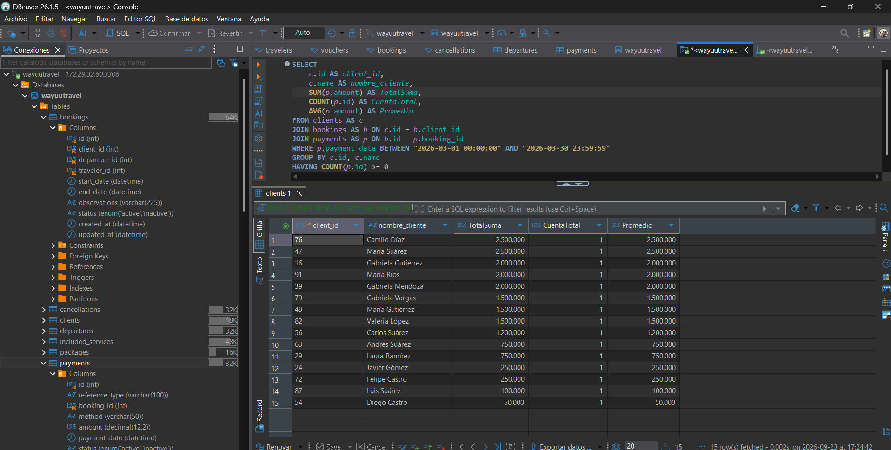

# 6. Subconsultas y Teoría de Conjuntos (A-B)

### 6.1: Clientes sin ventas en un rango usando subconsulta `NOT IN` (Forma 1)

``` sql
SELECT * FROM clients AS c 
WHERE c.id NOT IN (
SELECT b.client_id 
FROM bookings AS b 
JOIN payments AS p ON b.id = p.booking_id 
WHERE p.payment_date BETWEEN "2026-03-01 00:00:00" AND "2026-03-2 23:59:59"
);
```

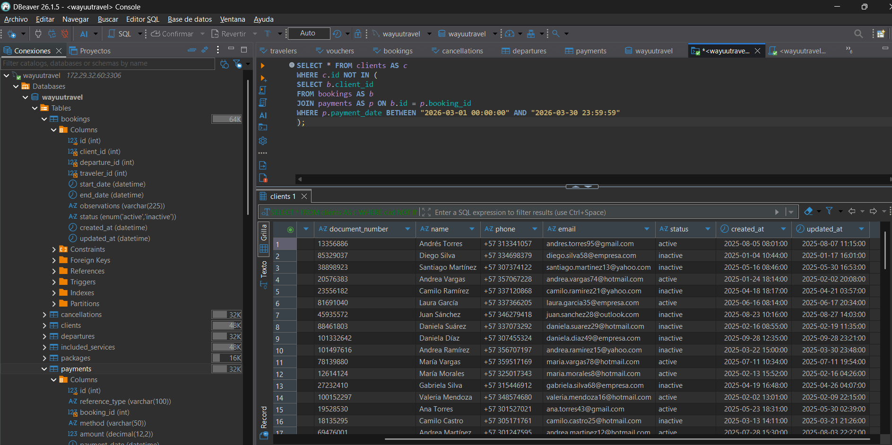

### 6.2: Clientes sin ventas en un rango usando `LEFT JOIN` y `IS NULL` (Forma 2)

``` sql
SELECT c.* FROM clients AS c 
LEFT JOIN (SELECT b.client_id 
FROM bookings AS b 
JOIN payments AS p ON b.id = p.booking_id 
WHERE p.payment_date BETWEEN "2026-03-01 00:00:00" AND "2026-03-30 23:59:59"
) AS v ON c.id = v.client_id 
WHERE v.client_id IS NULL;
```

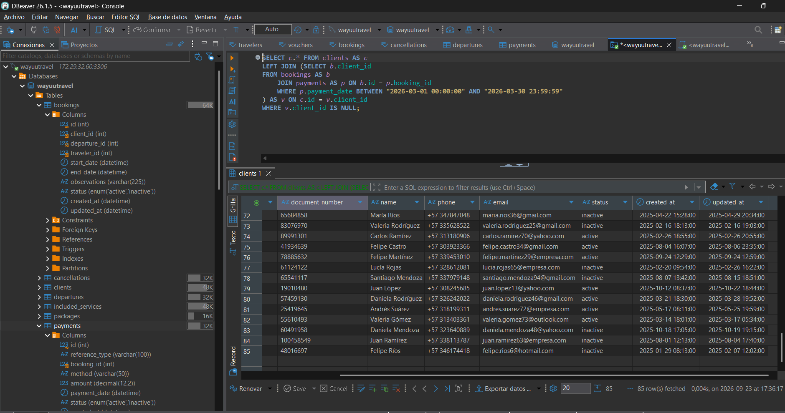

# Consultas avanzadas en postgres

## Evidencia de los registros de cada tabla

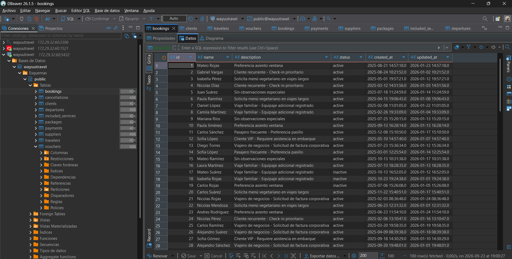

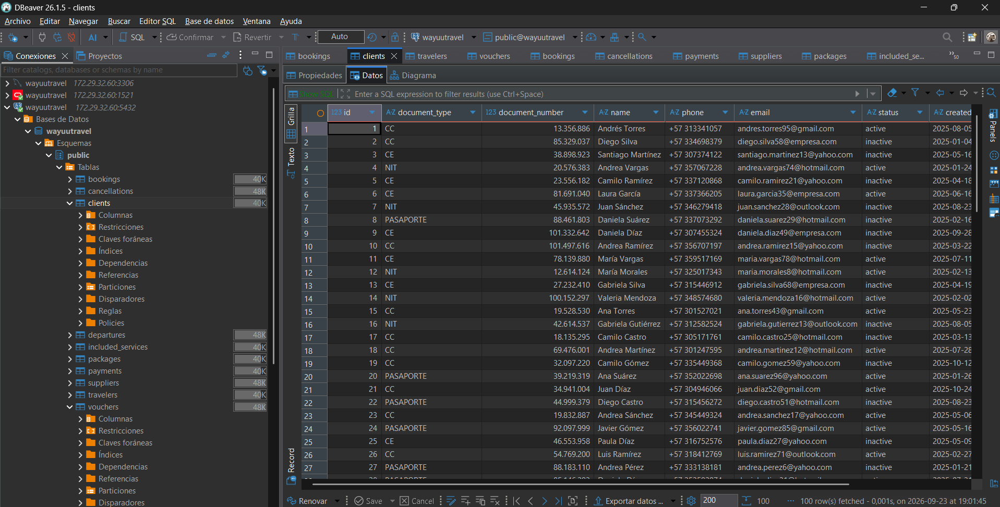](images/clipboard-3145780045.png)

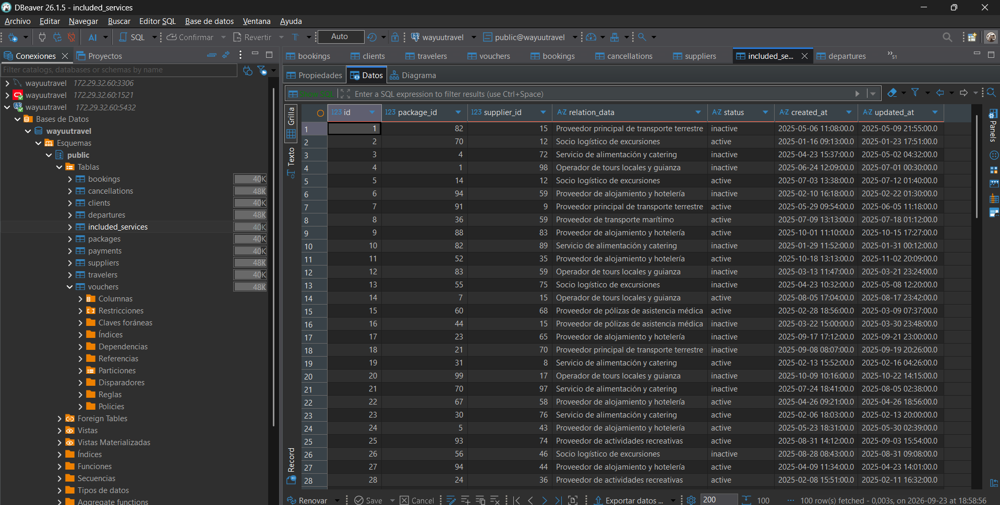](images/clipboard-1351705269.png)

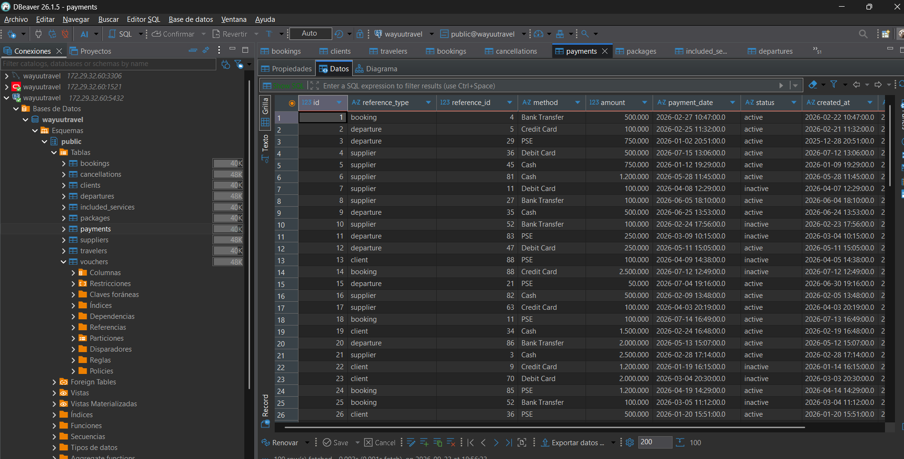](images/clipboard-3570937543.png)

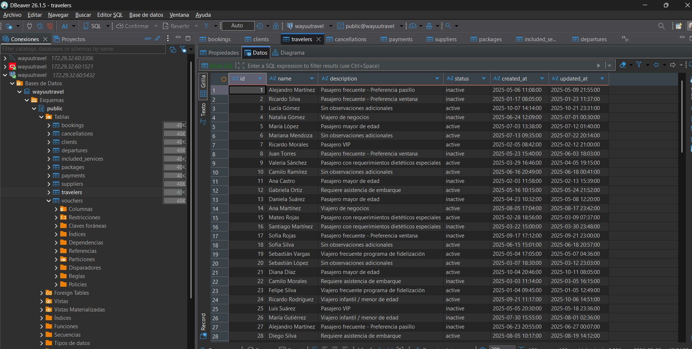](images/clipboard-1638466390.png)

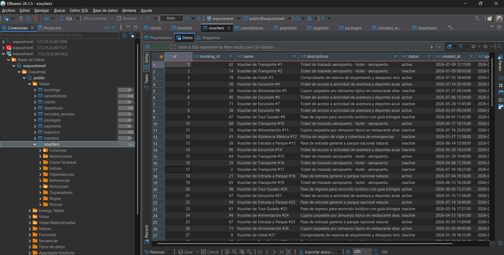

# 1. Consultar datos de una tabla (Consultas Básicas)

### 1.1: Todos los campos de una tabla

``` sql
SELECT * FROM public.clients;
```

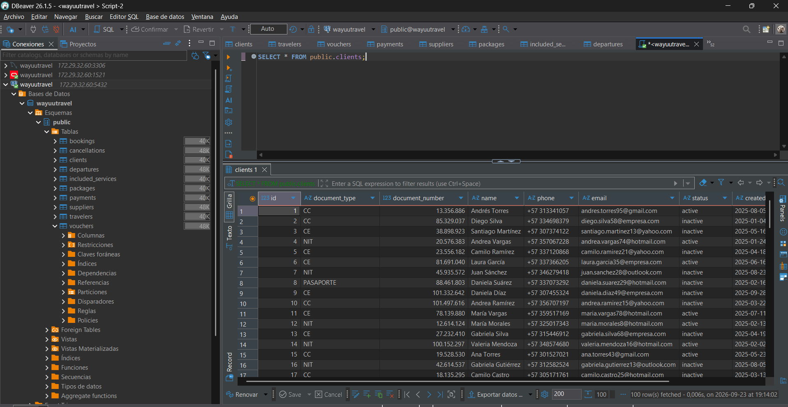

### 1.2: Campos específicos

``` sql
SELECT id, name, phone,  document_number 
FROM public.clients;
```

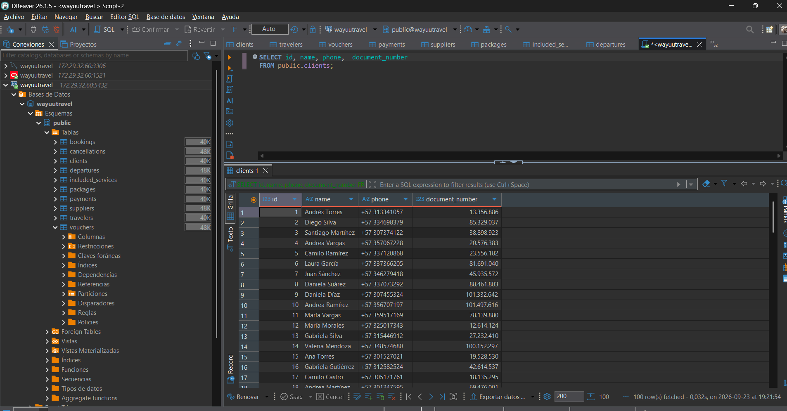

### 1.3: Campos especificos usando alias en la tabla

``` sql
SELECT c.name, c.document_number, c.phone  
FROM public.clients AS c;
```

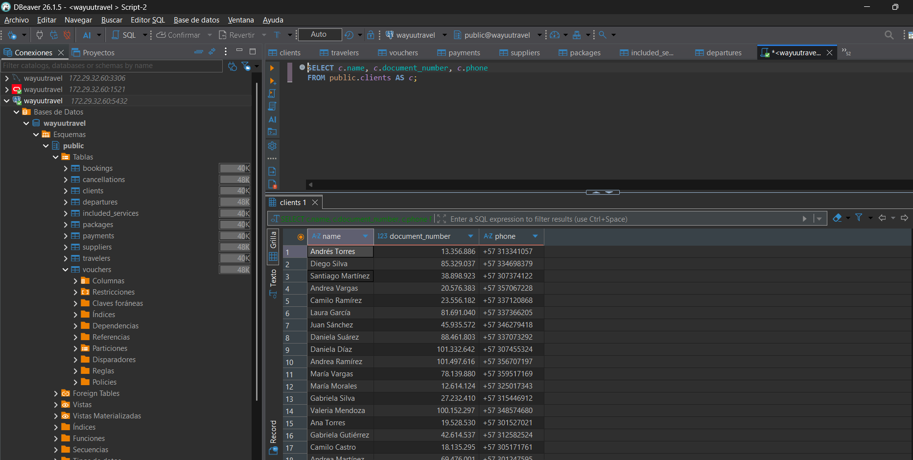

# 2. Consultar datos de varias tablas (Relaciones / Joins)

### 2.1: Relación mediante la cláusula WHERE (Forma 1)

``` sql
SELECT * FROM public.clients, public.bookings 
WHERE clients.id = bookings.id;
```

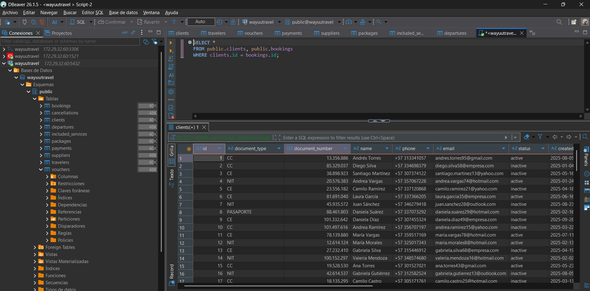

### 2.2: Relación mediante WHERE con alias 

``` sql
SELECT * FROM public.clients AS c, public.bookings AS b 
WHERE c.id = b.id;
```

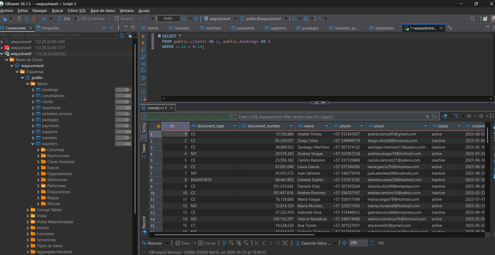

### 2.3: Selección de campos específicos y comodín de tabla (V.\*) usando WHERE 

``` sql
SELECT c.name, c.email, b.* FROM public.clients AS c, public.bookings AS b 
WHERE c.id = b.id;
```

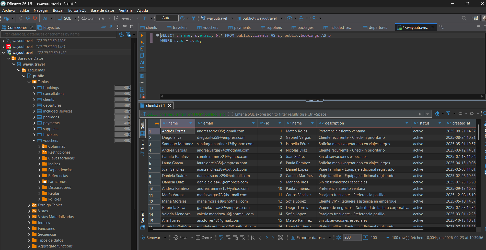

### 2.4: Relación mediante la cláusula JOIN ... ON (Forma 2)

``` sql
SELECT  c.name, c.email, b.* FROM public.clients AS c 
JOIN public.bookings AS b ON c.id = b.id;
```

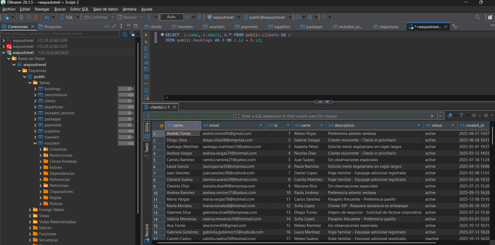

# 3. Condiciones y Filtros en las Consultas

### 3.1: Filtro por fecha en consulta multitabla (Forma 1 - WHERE)

``` sql
SELECT  c.name, c.email, b.* FROM public.clients AS c, public.bookings AS b 
WHERE c.id = b.id 
AND b.created_at = '2026-02-17 11:00:00';
```

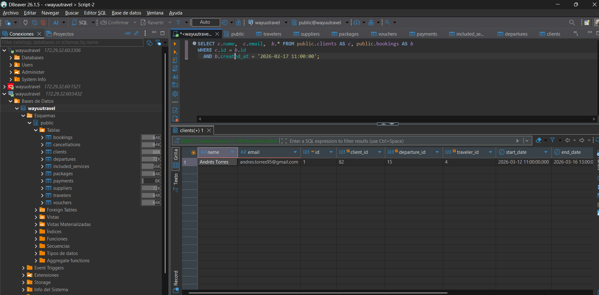

### 3.2: Filtro por fecha en consulta multitabla (Forma 2 - JOIN)

``` sql
 SELECT c.name,  c.email,  b.* FROM public.clients AS c 
JOIN public.bookings AS b ON c.id = b.id 
WHERE b.updated_at = '2026-02-20 11:00:00';
```

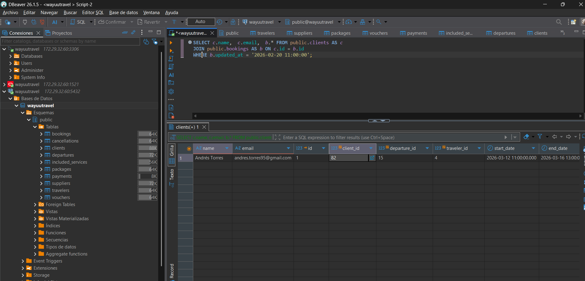

### 3.3: Filtro por patrón con LIKE (comienza con 'j' o 'm') 

``` sql
SELECT * FROM public.clients AS c 
WHERE c.name ILIKE 'm%'  OR c.name ILIKE 'j%';
```

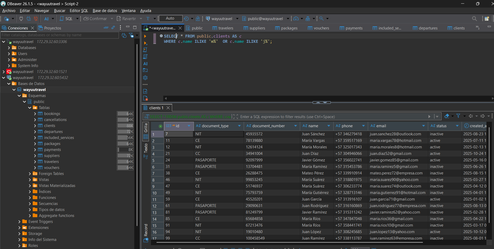

### 3.4: Filtro por patrón con LIKE y CONCAT (contiene 'Diego Silva' o '[diego.silva58\@gmail.com](mailto:diego.silva58@gmail.com){.email}')

``` sql
SELECT * FROM public.clients AS c 
WHERE c.name ILIKE '%Diego Silva%'  OR c.email ILIKE '%diego.silva58@gmail.com%';
```

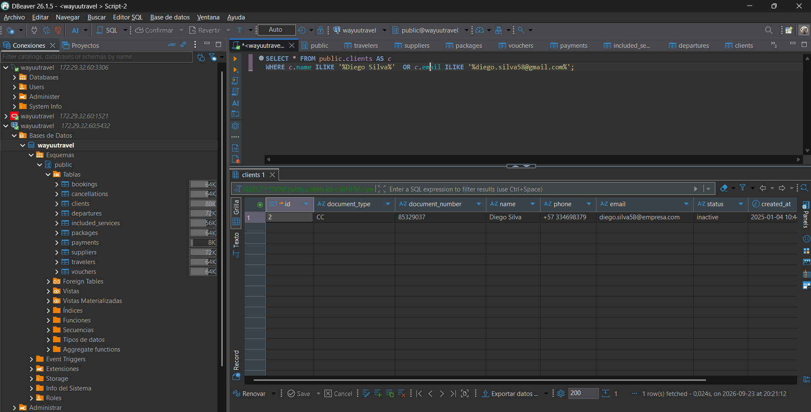

###  3.5: Consulta entre 4 tablas unidas con rango de fechas y ordenamiento (Forma 1 - WHERE)

``` sql
SELECT c.*,  b.*,  d.*, t.*, v.* FROM public.clients AS c, 
  public.bookings AS b, 
  public.departures AS d, 
  public.travelers AS t,  
  public.vouchers AS v 
WHERE c.id = b.id 
  AND d.id = b.id 
  AND t.id = b.id 
  AND b.id = v.booking_id 
  AND v.created_at BETWEEN '2026-05-03 08:22:00' AND '2026-07-03 11:04:00' 
ORDER BY v.created_at ASC;
```

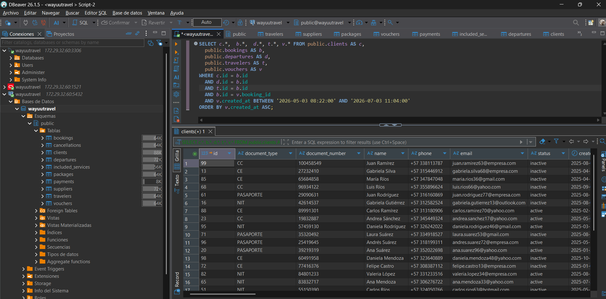

###  3.6: Consulta entre 4 tablas unidas con rango de fechas y ordenamiento (Forma 2 - JOIN)

``` sql
SELECT * FROM public.clients AS c 
JOIN public.bookings AS b ON c.id = b.id 
JOIN public.vouchers AS v ON b.id = v.booking_id 
WHERE b.created_at BETWEEN '2026-02-17 11:00:00' AND '2026-05-16 12:00:00' 
ORDER BY b.created_at ASC;
```

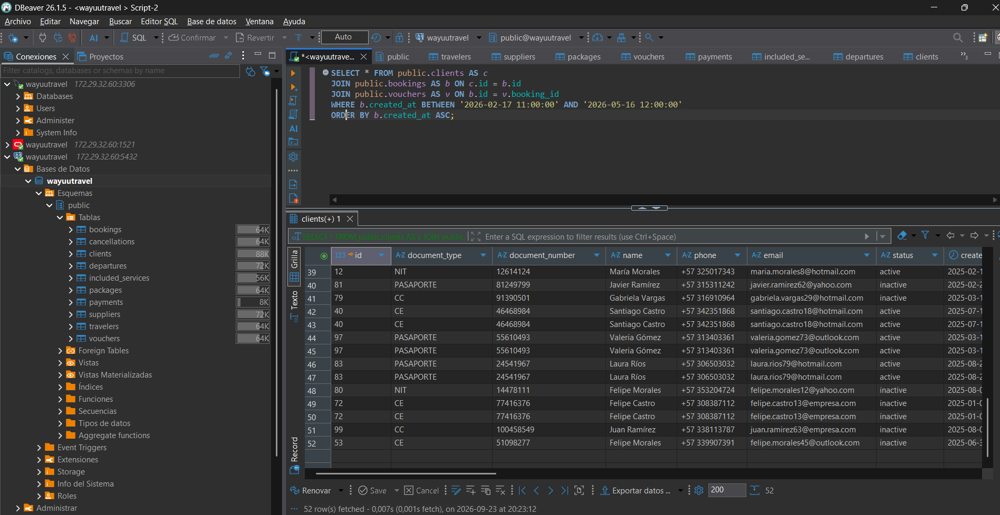

# 4. Consultas de Agrupamiento (GROUP BY)

### 4.1: Suma, conteo y promedio por cliente en rango de fechas (Forma 1 - WHERE) 

``` sql
SELECT c.id AS client_id,  c.name AS nombre_cliente,c.document_number,
 COUNT(b.id) AS total_reservas,
 SUM(d.id  ) AS suma_total_paquetes,
 ROUND(AVG(d.id ), 2) AS promedio_por_reserva
FROM public.bookings AS b
JOIN public.departures AS d ON b.id = d.id
JOIN public.clients AS c ON b.id = c.id
WHERE b.created_at BETWEEN '2026-01-01 00:00:00' AND '2026-03-31 23:59:59' 
  AND b.status = 'active'
GROUP BY c.id, c.name, c.document_number;
```

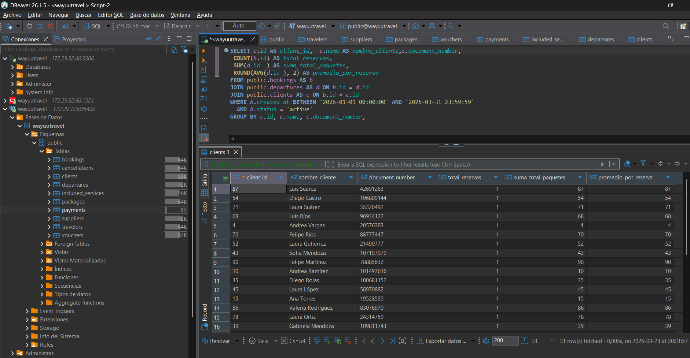

### 4.2: Suma, conteo y promedio por cliente en rango de fechas (Forma 2 - JOIN)

``` sql
SELECT  c.id AS client_id,  c.name AS nombre_cliente, c.document_number,
 COUNT(p.id) AS total_paquetes_reservados,
 SUM(p.id) AS suma_total_paquetes,
 ROUND(AVG(p.id), 2) AS promedio_precio_paquete
FROM public.bookings AS b
JOIN public.departures AS d ON b.id = d.id
JOIN public.packages AS p ON d.package_id = p.id
JOIN public.clients AS c ON b.id = c.id
WHERE b.created_at BETWEEN '2026-01-01 00:00:00' AND '2026-03-31 23:59:59' 
AND b.status = 'active'
GROUP BY c.id, c.name, c.document_number;
```

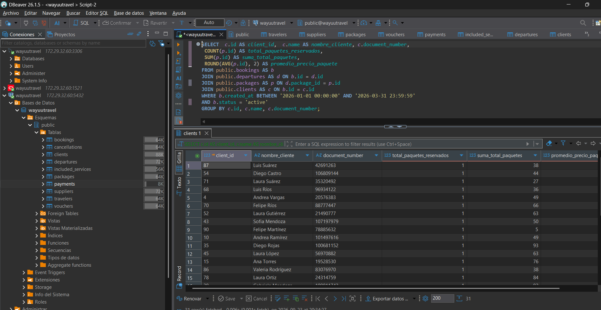

# 5. Consultas de Agrupamiento con Filtro Post-Agregación (HAVING)

### 5.1: Agrupamiento con condición de conteo HAVING (Forma 1 - WHERE)

``` sql
SELECT c.id AS client_id,  c.name AS nombre_cliente,
 SUM(d.id) AS totalsuma, 
 COUNT(b.id) AS cuentatotal, 
 ROUND(AVG(d.id), 2) AS promedio  
FROM public.clients AS c, public.bookings AS b, public.departures AS d 
WHERE c.id = b.id 
  AND b.id = d.id 
  AND b.created_at BETWEEN '2026-03-01 00:00:00' AND '2026-03-30 23:59:59'
  AND b.status = 'active'
GROUP BY c.id, c.name 
HAVING COUNT(b.id) >= 1 
ORDER BY totalsuma DESC;
```

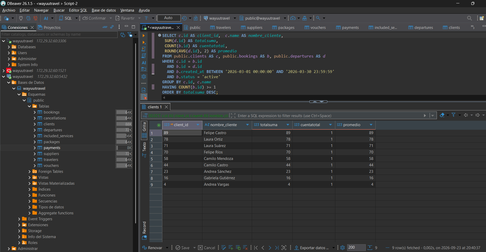

###  5.2: Agrupamiento con condición de conteo HAVING (Forma 2 - JOIN)

``` sql
SELECT c.id AS client_id, c.name AS nombre_cliente,
 SUM(d.id) AS totalsuma, 
 COUNT(b.id) AS cuentatotal, 
 ROUND(AVG(d.id), 2) AS promedio  
FROM public.clients AS c
JOIN public.bookings AS b ON c.id = b.id
JOIN public.departures AS d ON b.id = d.id
WHERE b.created_at BETWEEN '2026-03-01 00:00:00' AND '2026-03-30 23:59:59'
  AND b.status = 'active'
GROUP BY c.id, c.name 
HAVING COUNT(b.id) >= 1
ORDER BY totalsuma DESC;
```

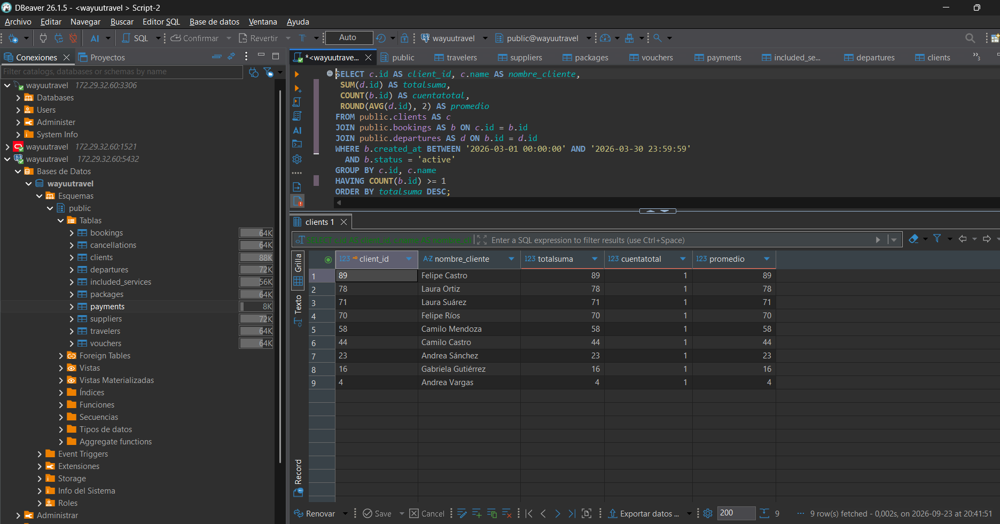

# 6. Subconsultas y Teoría de Conjuntos (A-B)

### 6.1: Clientes sin ventas en un rango usando subconsulta NOT IN (Forma 1)

``` sql
SELECT * FROM public.clients AS c 
WHERE c.id NOT IN (
    SELECT b.id 
    FROM public.bookings AS b 
    JOIN public.payments AS p ON b.id = p.id 
    WHERE p.payment_date BETWEEN '2026-03-01 00:00:00' AND '2026-03-30 23:59:59'
);
```

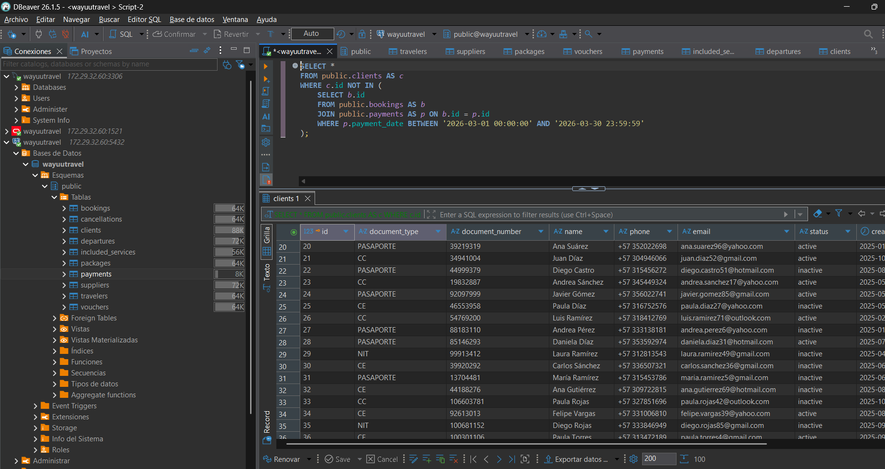

###  6.2: Clientes sin ventas en un rango usando LEFT JOIN y IS NULL (Forma 2)

``` sql
SELECT c.* FROM public.clients AS c 
LEFT JOIN (
    SELECT DISTINCT b.id 
    FROM public.bookings AS b 
    JOIN public.payments AS p ON b.id = p.id 
    WHERE p.payment_date BETWEEN '2026-03-01 00:00:00' AND '2026-03-30 23:59:59'
) AS v ON c.id = v.id 
WHERE v.id IS NULL;
```

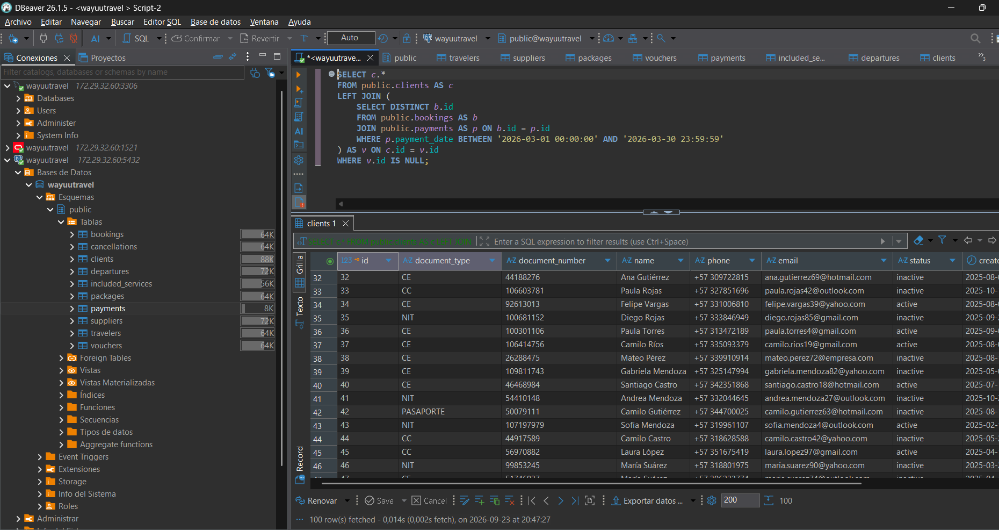

# Consultas en MySQL-Server

## Evidencia de los registros de cada tabla

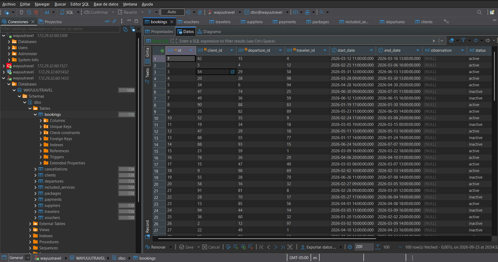

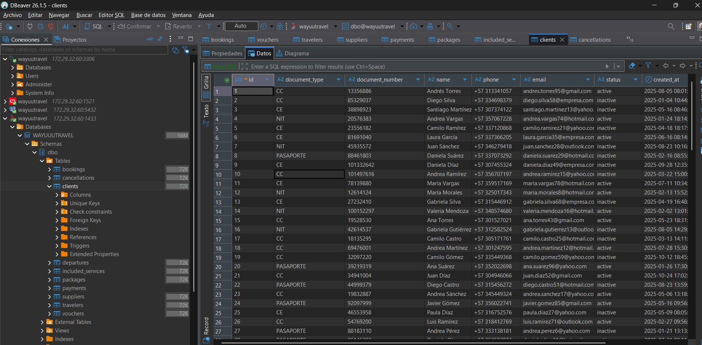](images/clipboard-487159671.png)

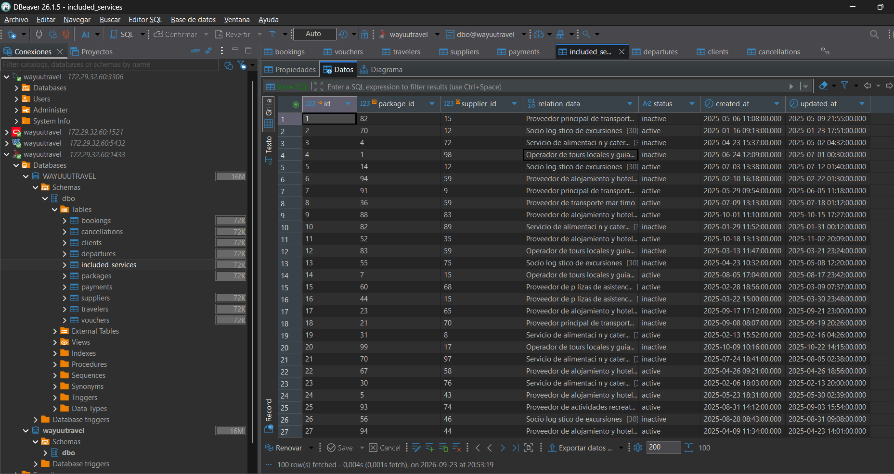](images/clipboard-2464897793.png)

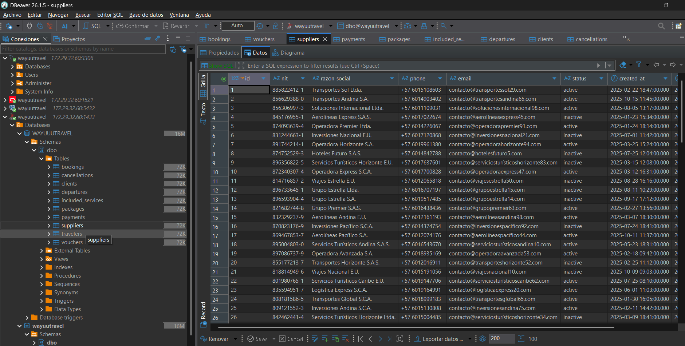](images/clipboard-3283409493.png)

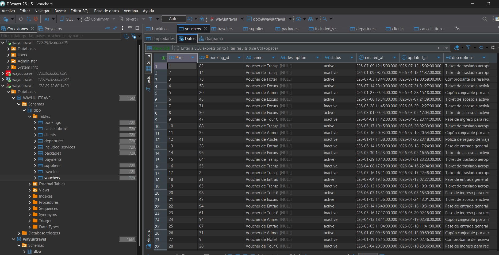](images/clipboard-1197245840.png)

# 1.Consultar datos de una tabla (Consultas Básicas)

### 1.1: Todos los campos de una tabla 

``` sql
SELECT * FROM dbo.suppliers;
```

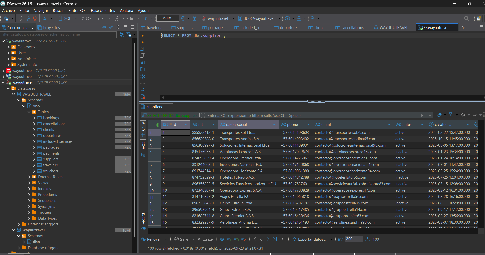

### 1.2: Campos específicos 

``` sql
SELECT   id, name,  created_atFROM dbo.vouchers ;
```

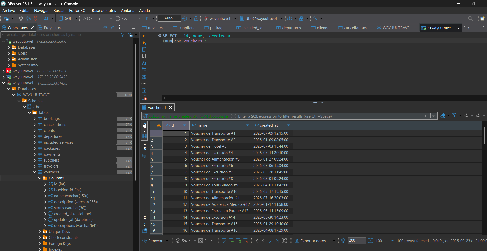

### 1.3: Campos específicos usando alias en la tabla

``` sql
SELECT    v.name, v.name,  v.created_at,  v.descriptions 
FROM dbo.vouchers  AS v;
```

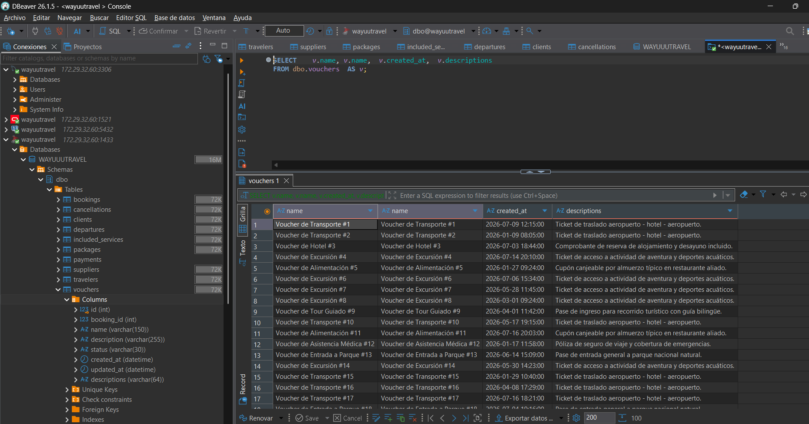

# 2. Consultar datos de varias tablas (Relaciones / Joins)

### 2.1: Relación mediante la cláusula WHERE (Forma 1)

``` sql
 SELECT * FROM dbo.clients, dbo.bookings, dbo.vouchers 
WHERE clients.id = bookings.client_id 
  AND bookings.id = vouchers.booking_id;
```

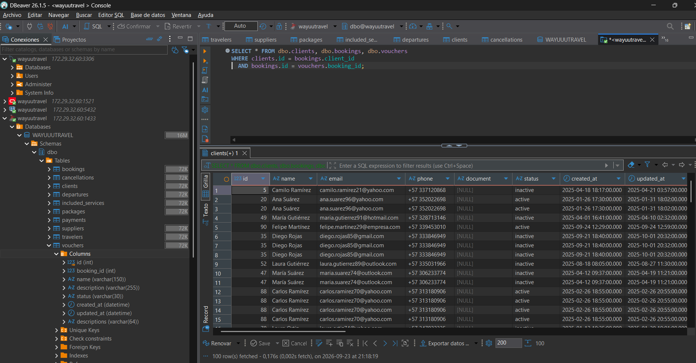

### 2.2: Relación mediante WHERE con alias 

``` sql
SELECT * FROM dbo.clients AS c, dbo.bookings AS b, dbo.vouchers AS v 
WHERE c.id = b.client_id 
  AND b.id = v.booking_id;
```

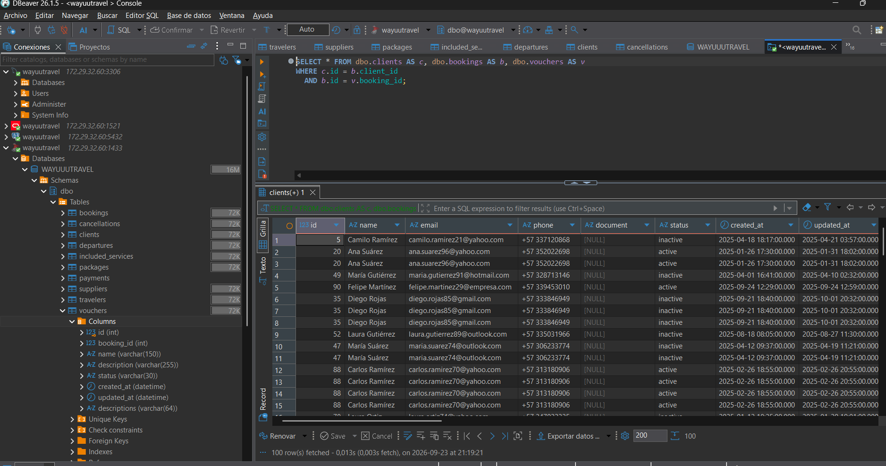

### 2.3: Selección de campos específicos y comodín de tabla (V.\*) usando WHERE 

``` sql
SELECT c.name,  c.email,  v.* FROM dbo.clients AS c, dbo.bookings AS b, dbo.vouchers AS v 
WHERE c.id = b.client_id 
AND b.id = v.booking_id;
```

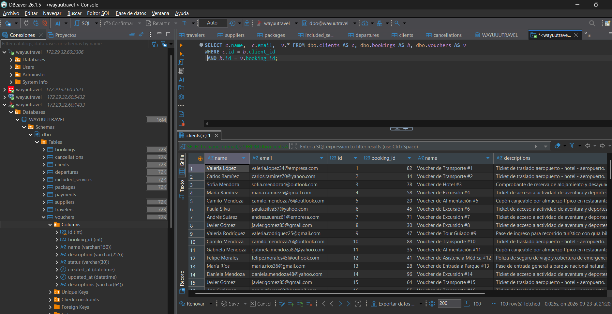

### 2.4: Relación mediante la cláusula JOIN ... ON (Forma 2)

``` sql
SELECT  c.name,  c.email, v.* FROM dbo.clients AS c 
INNER JOIN dbo.bookings AS b ON c.id = b.client_id 
INNER JOIN dbo.vouchers AS v ON b.id = v.booking_id;
```

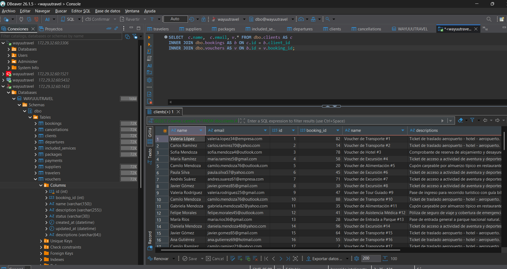

# 3. Condiciones y Filtros en las Consultas

### 3.1: Filtro por fecha en consulta multitabla (Forma 1 - WHERE)

``` sql
SELECT  c.name,  c.email, v.* FROM dbo.clients AS c, dbo.bookings AS b, dbo.vouchers AS v 
WHERE c.id = b.client_id 
AND b.id = v.booking_id 
AND v.created_at = '2026-05-28 11:45:00.000';
```

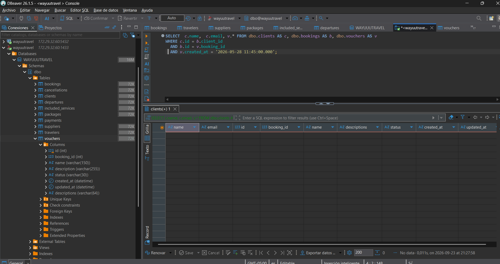

### 3.2: Filtro por fecha en consulta multitabla (Forma 2 - JOIN) 

``` sql
SELECT  c.name AS nombre_cliente,  c.email AS email_cliente, t.name,  t.name,  b.updated_at AS fecha_actualizacion 
FROM dbo.clients AS c 
INNER JOIN dbo.bookings AS b ON c.id = b.client_id 
INNER JOIN dbo.travelers AS t ON t.id = b.traveler_id 
WHERE b.updated_at = '2026-02-20 11:00:00';
```

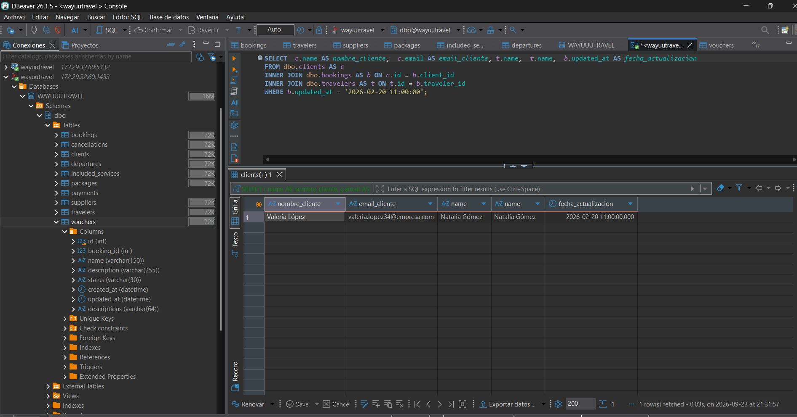

### 3.3: Filtro por patrón con LIKE (comienza con 'j' o 'm') 

``` sql
SELECT * FROM dbo.travelers AS t 
WHERE t.name LIKE 'm%' 
   OR t.name LIKE 'j%';
```

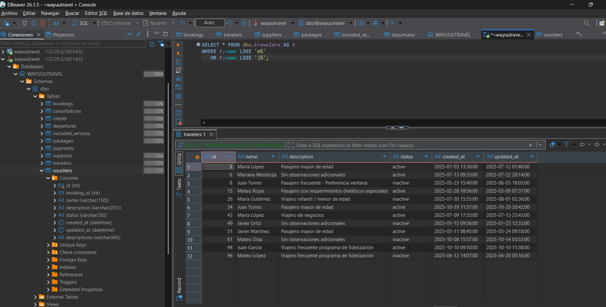

### 3.4: Filtro por patrón con LIKE y CONCAT (contiene 'Diego ' o 'Silva')

``` sql
SELECT * FROM dbo.travelers AS t 
WHERE t.name LIKE '%Diego%' 
 OR t.name LIKE '%Silva%';
```

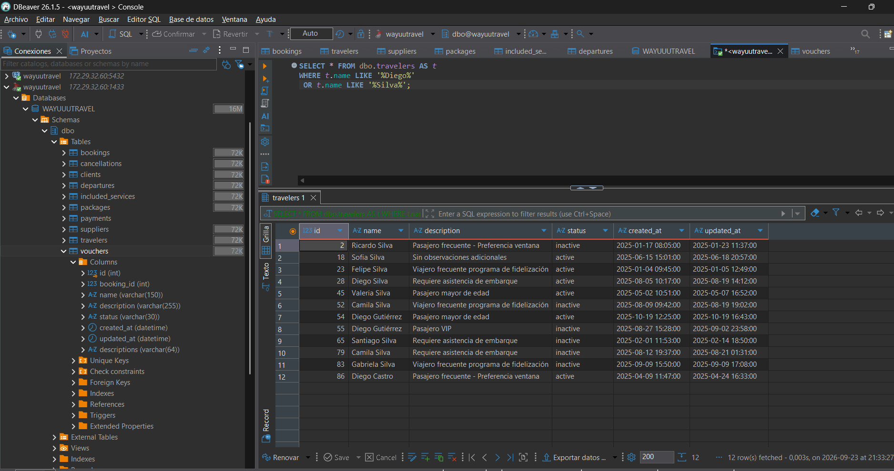

### 3.5: Consulta entre 4 tablas unidas con rango de fechas y ordenamiento (Forma 1 - WHERE)

``` sql
SELECT c.name AS cliente, b.id AS reserva_id, d.id AS salida_id, t.name AS viajero_nombre,  v.id AS voucher_id 
FROM dbo.clients AS c, dbo.bookings AS b, dbo.departures AS d, dbo.travelers AS t, dbo.vouchers AS v 
WHERE c.id = b.client_id 
  AND d.id = b.departure_id 
  AND t.id = b.traveler_id 
  AND b.id = v.booking_id 
  AND b.created_at BETWEEN '2026-01-01 00:00:00' AND '2026-03-31 23:59:59' 
ORDER BY b.created_at ASC;
```

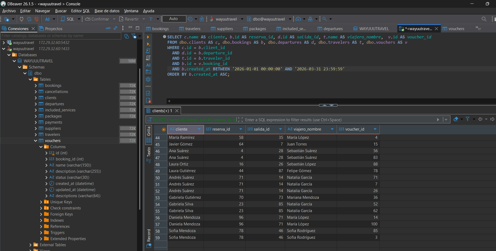

###  3.6: Consulta entre 4 tablas unidas con rango de fechas y ordenamiento (Forma 2 - JOIN)

``` sql
SELECT c.name AS cliente, t.name AS viajero_nombre,  t.name AS viajero_apellido,  b.created_at AS fecha_reserva 
FROM dbo.clients AS c 
INNER JOIN dbo.bookings AS b ON c.id = b.client_id 
INNER JOIN dbo.travelers AS t ON t.id = b.traveler_id 
WHERE b.created_at BETWEEN '2026-01-01 00:00:00' AND '2026-03-31 23:59:59' 
ORDER BY b.created_at ASC;
```

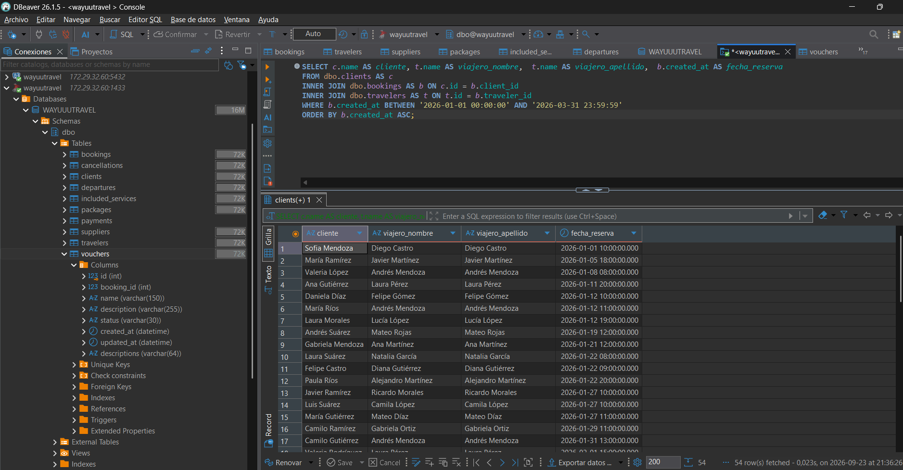

# 4. Consultas de Agrupamiento (GROUP BY)

### 4.1: Suma, conteo y promedio por cliente en rango de fechas (Forma 1 - WHERE) 

``` sql
SELECT b.client_id, 
COUNT(t.id) AS total_pasajeros_registrados 
FROM dbo.bookings AS b 
INNER JOIN dbo.travelers AS t ON t.id = b.traveler_id 
GROUP BY b.client_id;
```

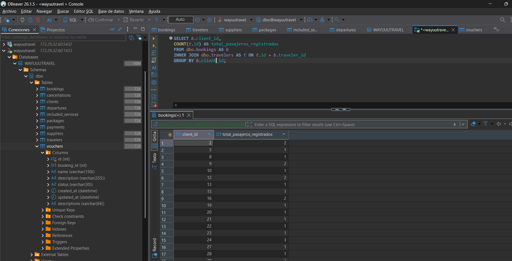

### 4.2: Suma, conteo y promedio por cliente en rango de fechas (Forma 2 - JOIN)

``` sql
SELECT b.client_id, 
COUNT(t.id) AS total_pasajeros_registrados 
FROM dbo.bookings AS b 
INNER JOIN dbo.travelers AS t ON t.id = b.traveler_id 
GROUP BY b.client_id;
```

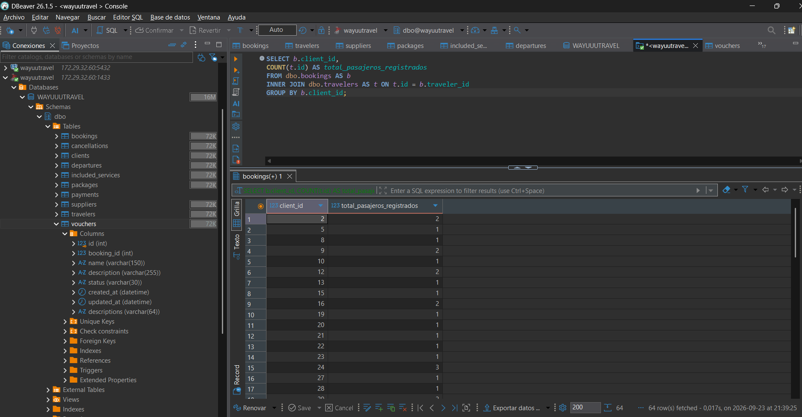

# 5 .Consultas de Agrupamiento con Filtro Post-Agregación (HAVING)

### 5.1: Agrupamiento con condición de conteo HAVING (Forma 1 - WHERE) 

``` sql
SELECT c.id AS client_id, c.name AS nombre_cliente, 
COUNT(t.id) AS total_pasajeros 
FROM dbo.clients AS c, dbo.bookings AS b, dbo.travelers AS t 
WHERE c.id = b.client_id 
AND t.id = b.traveler_id 
GROUP BY c.id, c.name 
HAVING COUNT(t.id) >= 1 
ORDER BY total_pasajeros DESC;
```

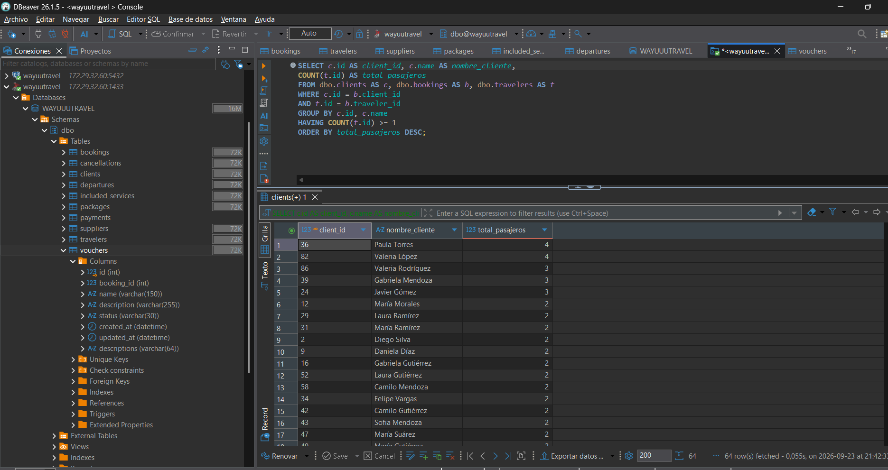

### 5.2: Agrupamiento con condición de conteo HAVING (Forma 2 - JOIN)

``` {.sql .sq}
SELECT   c.id AS client_id,  c.name AS nombre_cliente, 
COUNT(t.id) AS total_pasajeros 
FROM dbo.clients AS c 
INNER JOIN dbo.bookings AS b ON c.id = b.client_id 
INNER JOIN dbo.travelers AS t ON t.id = b.traveler_id 
GROUP BY c.id, c.name 
HAVING COUNT(t.id) >= 1 
ORDER BY total_pasajeros DESC;
```

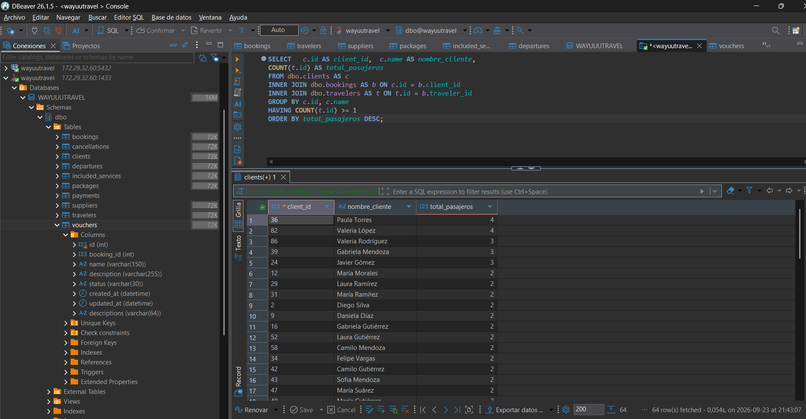

# 6. Subconsultas y Teoría de Conjuntos (A-B)

### 6.1: Clientes sin ventas en un rango usando subconsulta NOT IN (Forma 1)

``` sql
SELECT * FROM dbo.clients AS c 
WHERE c.id NOT IN (
    SELECT DISTINCT b.client_id 
    FROM dbo.bookings AS b 
    INNER JOIN dbo.travelers AS t ON t.id = b.traveler_id 
    WHERE b.traveler_id IS NOT NULL
);
```

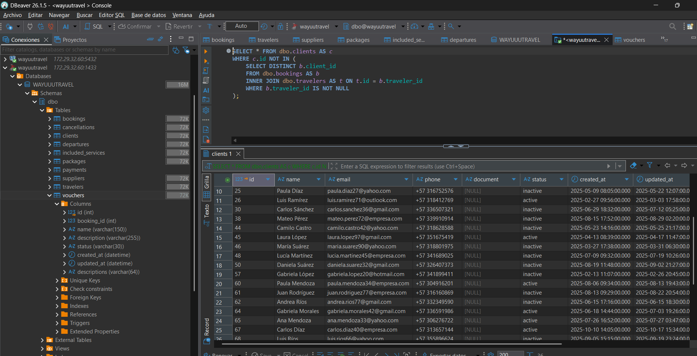

### 6.2: Clientes sin ventas en un rango usando LEFT JOIN y IS NULL (Forma 2)

``` sql
SELECT c.* FROM dbo.clients AS c 
LEFT JOIN (
    SELECT DISTINCT b.client_id 
    FROM dbo.bookings AS b 
    INNER JOIN dbo.travelers AS t ON t.id = b.traveler_id 
) AS t_sub ON c.id = t_sub.client_id 
WHERE t_sub.client_id IS NULL;
```

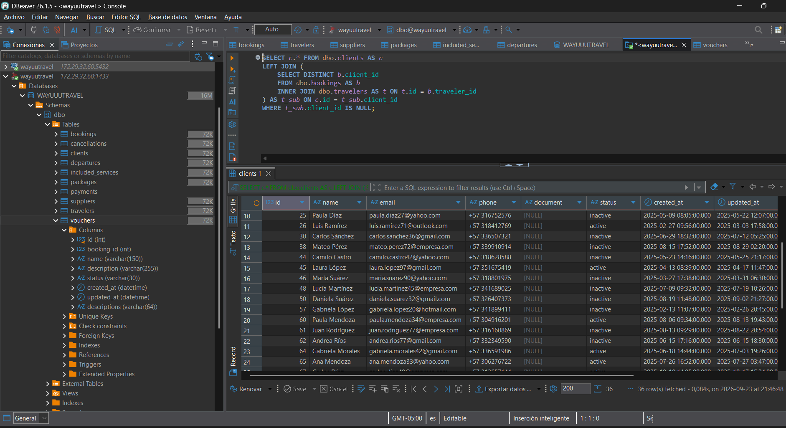

# Consultas avanzadas en Oracle

## Evidencia de los registros de cada tabla

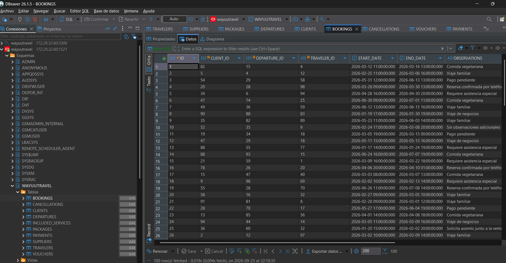

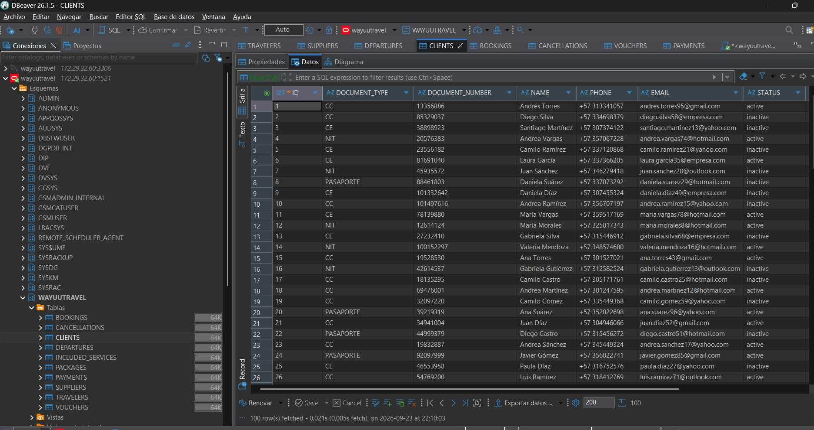](images/clipboard-2104359377.png)

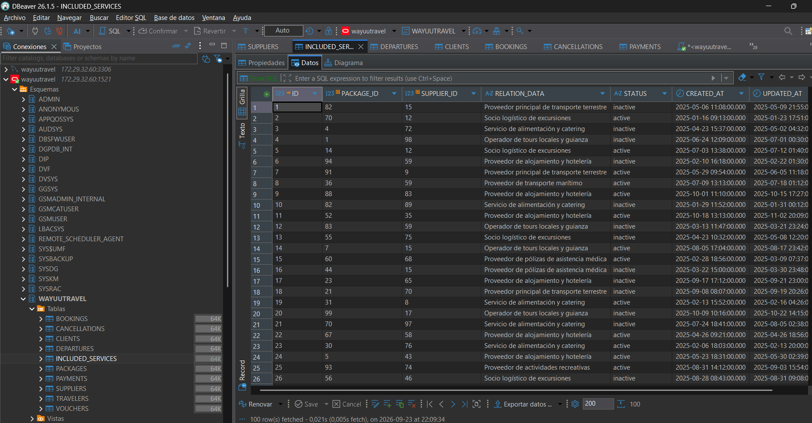](images/clipboard-3690301211.png)

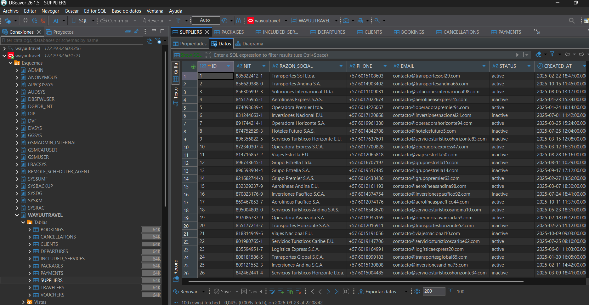](images/clipboard-3623632094.png)

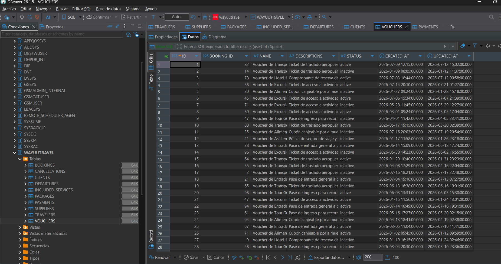](images/clipboard-2898357617.png)

# 1. Consultar datos de una tabla (Consultas Básicas)

### 1.1: Todos los campos de una tabla 

``` sql
SELECT * FROM suppliers;
```

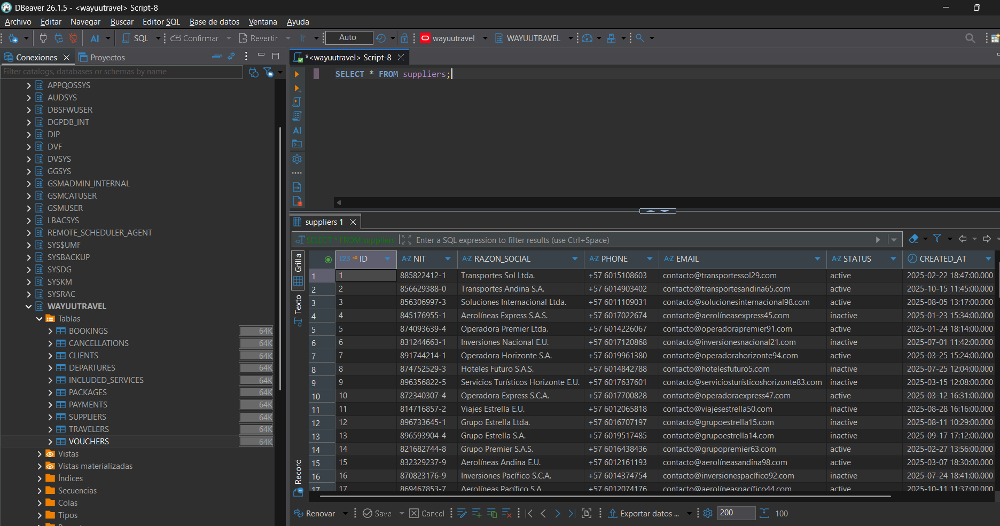

### 1.2: Campos específicos 

``` sql
SELECT  id, nit,  razon_social, phone, email 
FROM suppliers;
```

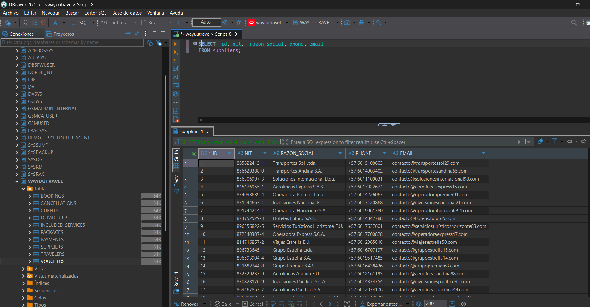

### 1.3: Campos específicos usando alias en la tabla

``` sql
SELECT   s.id,  s.nit,  s.razon_social,  s.status 
FROM suppliers s;
```

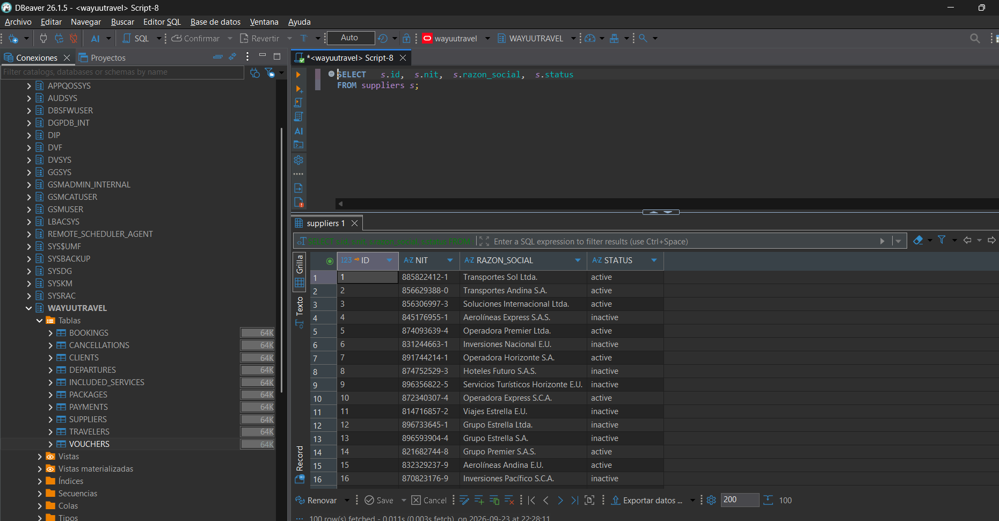

# 2. Consultar datos de varias tablas (Relaciones / Joins)

### 2.1: Relación mediante la cláusula WHERE (Forma 1) 

``` sql
SELECT * FROM suppliers s, included_services ins, packages p 
WHERE s.id = ins.supplier_id 
 AND p.id = ins.package_id;
```

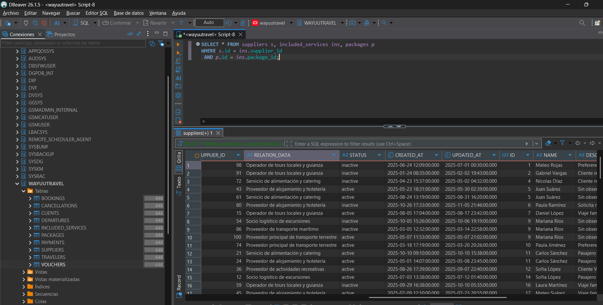

### 2.2: Relación mediante WHERE con alias 

``` sql
SELECT * FROM packages p, departures d 
WHERE p.id = d.package_id;
```

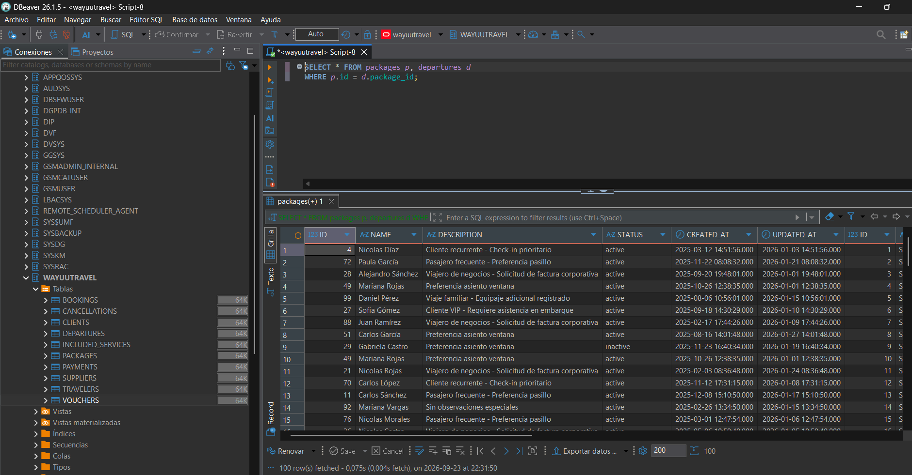

### 2.3: Selección de campos específicos y comodín de tabla (V.\*) usando WHERE 

``` sql
SELECT p.name AS nombre_paquete,  p.description AS descripcion_paquete,  d.* FROM packages p, departures d 
WHERE p.id = d.package_id;
```

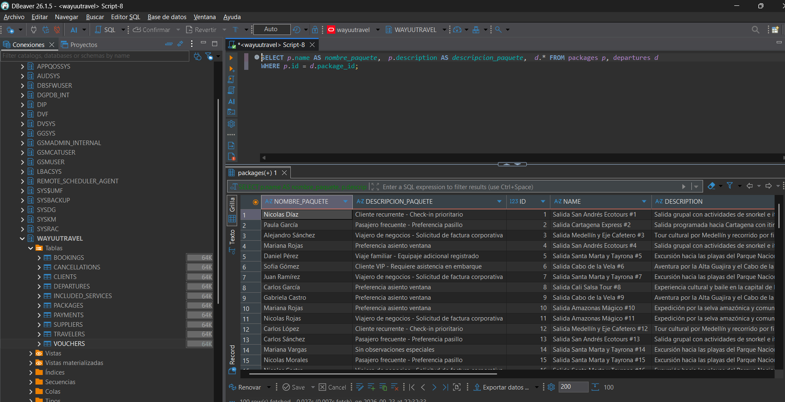

### 2.4: Relación mediante la cláusula JOIN ... ON (Forma 2)

``` {.sql .sq}
SELECT  s.razon_social AS proveedor,  p.name AS paquete, ins.relation_data AS detalle_servicio 
FROM suppliers s 
JOIN included_services ins ON s.id = ins.supplier_id 
JOIN packages p ON p.id = ins.package_id;
```

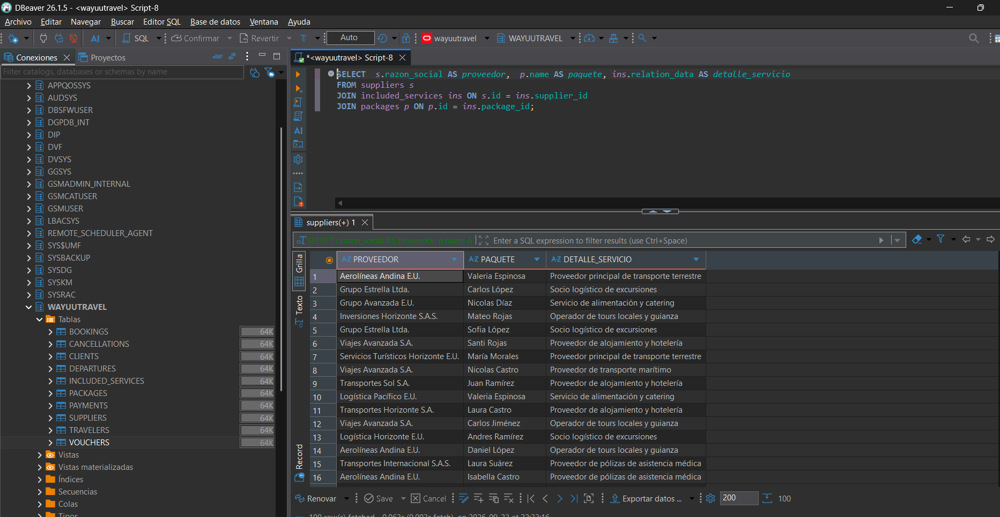
